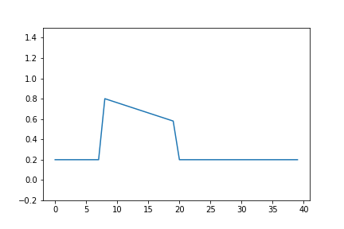

# Shallow water simulation with use of MPyDATA solver

### Requirements installation
```python
git clone https://github.com/pawel-rozwoda/shallow-water
cd shallow-water
virtualenv --python=python3 venv
source venv/bin/activate
pip install -r requirements.txt
python -m notebook
```


### First we need to choose number of domain data points `nx`, time step `dt` and also space between data points `dx`
```python
nx = 40
dt = 0.01
dx = 1.
``` 

### To perform simulation one need to initialize liquid state `h` as well as velocity `u` 
```python
initial_m_value = 0.2
h_initial = np.full(nx, initial_m_value)
h_initial[8:20] = np.array([0.8 - (0.02 * i)  for i in range(12)])

h_old = np.array(h_initial)
h_new = np.array(h_initial)

u_initial = np.zeros((nx + 1))
u_old = np.array(u_initial)
u_new = np.array(u_initial)

```
above snippet would setup liquid as following.





### Additional variables required by shallow water equations 
```python
uh_new = np.zeros(nx)
uh_old = np.zeros(nx)
rhs_old = np.array(h_old)
rsh_old = np.zeros(nx)
```

### Now transform these variables into form which is understood by MPyDATA solver
```python
from MPyDATA import ScalarField, VectorField, PeriodicBoundaryCondition
from MPyDATA.options import Options
options = Options(n_iters=2, infinite_gauge=True, flux_corrected_transport=True)
halo = options.n_halo

advectee = ScalarField(
    data = h_new,
    halo=halo, 
    boundary_conditions=(PeriodicBoundaryCondition(), )
)

advector = VectorField(
    data = (u_initial,),
    halo=halo,
    boundary_conditions=(PeriodicBoundaryCondition(), )   
)
```

### Solver for sw equations looks as follows
```python
from mpdata import mpdata_wrapper
MPDATA = mpdata_wrapper(advector, advectee, (nx,))
```


### Main loop
```python 
g = 9.8 # m/s^2
for i in range(20):
    u_mid = extrapolate_in_time(interpolate_in_space(uh_new, h_new), interpolate_in_space(uh_old, h_old))
    
    #RHS = 0, mass conservation
    h_new[:] = MPDATA(u_mid, h_old)
    rhs_new = -g *  h_new * grad(h_new, dx=dx)

    #momentum conservation
    uh_new[:] = MPDATA(u_mid, uh_old + .5 * dt * rhs_old) + .5 * dt * rhs_new
    
    #plot figure
    plt.ylim(-.5, 1.5)
    plt.plot(h_new, '-')
    plt.show()
    
    # replace variables
    h_old, h_new = h_new, h_old
    u_old, u_new = u_new, u_old
    rhs_old, rhs_new = rhs_new, rhs_old
    uh_old, uh_new = uh_new, uh_old
```
