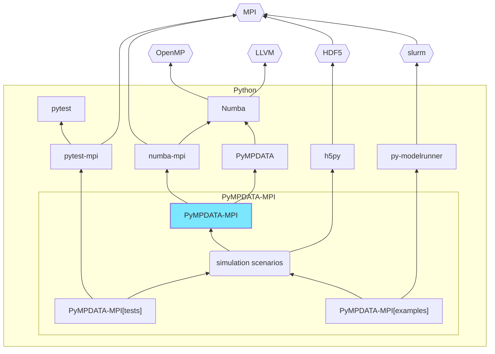

# PyMPDATA-MPI

    

    

   

    

PyMPDATA-MPI constitutes a [PyMPDATA](https://github.com/open-atmos/PyMPDATA) +
[numba-mpi](https://github.com/numba-mpi/numba-mpi) coupler enabling numerical solutions
of transport equations with the MPDATA numerical scheme in a
hybrid parallelisation model with both multi-threading and MPI distributed memory communication.
PyMPDATA-MPI adapts to API of PyMPDATA offering domain decomposition logic.

## Hello world examples

In a minimal setup, PyMPDATA-MPI can be used to solve the following transport equation: 
$$\partial_t (G \psi) + \nabla \cdot (Gu \psi)= 0$$
in an environment with multiple nodes.
Every node (process) is responsible for computing its part of the decomposed domain.

### Spherical scenario (2D)

In spherical geometry, the $G$ factor represents the Jacobian of coordinate transformation.
In this example (based on a test case from [Williamson & Rasch 1989](https://doi.org/10.1175/1520-0493(1989)117<0102:TDSLTW>2.0.CO;2)),
  domain decomposition is done cutting the sphere along meridians.
The inner dimension uses the [`MPIPolar`](https://open-atmos.github.io/PyMPDATA-MPI/mpi_polar.html) 
  boundary condition class, while the outer dimension uses
  [`MPIPeriodic`](https://open-atmos.github.io/PyMPDATA-MPI/mpi_periodic.html).
Note that the spherical animations below depict simulations without MPDATA corrective iterations,
  i.e. only plain first-order upwind scheme is used (FIX ME).

### 1 worker (n_threads = 1)

   

### 2 workers (MPI_DIM = 0, n_threads = 1)

   
  

### Cartesian scenario (2D)

In the cartesian example below (based on a test case from [Arabas et al. 2014](https://doi.org/10.3233/SPR-140379)),
  a constant advector field $u$ is used (and $G=1$).
MPI (Message Passing Interface) is used 
  for handling data transfers and synchronisation with the domain decomposition
  across MPI workers done in either inner or in the outer dimension (user setting).
Multi-threading (using, e.g., OpenMP via Numba) is used for shared-memory parallelisation 
  within subdomains (indicated by dotted lines in the animations below) with threading subdomain
  split done across the inner dimension (internal PyMPDATA logic).
In this example, two corrective MPDATA iterations are employed.

### 1 worker (n_threads=3)

   

### 2 workers (MPI_DIM = 0, n_threads = 3)

  
   

### 2 workers (MPI_DIM = -1, n_threads = 3)

  
   

### 3 workers (MPI_DIM = 0, n_threads = 3)

  
  
  

### 3 workers (MPI_DIM = -1, n_threads = 3)

  
  
  

## Package architecture

Rectangular boxes indicate pip-installable Python packages (click to go to pypi.org package site).

## Credits & acknowledgments:

PyMPDATA-MPI started as an [MSc project of Kacper Derlatka](https://www.ap.uj.edu.pl/diplomas/166883) ([@Delcior](https://github.com/Delcior)) mentored by [@slayoo](https://github.com/slayoo).

Development of PyMPDATA-MPI has been supported by the [Poland's National Science Centre](https://www.ncn.gov.pl/?language=en) 
(grant no. 2020/39/D/ST10/01220).

We acknowledge Poland’s high-performance computing infrastructure [PLGrid](https://plgrid.pl/) (HPC Centers: [ACK Cyfronet AGH](https://www.cyfronet.pl/en/)) 
for providing computer facilities and support within computational grant no. PLG/2023/016369

copyright: [Jagiellonian University](https://en.uj.edu.pl/en) & [AGH University of Krakow](https://agh.edu.pl/en)   
licence: [GPL v3](https://www.gnu.org/licenses/gpl-3.0.html)

## Design goals

- MPI support for [PyMPDATA](https://pypi.org/project/PyMPDATA/) implemented externally (i.e., not incurring any overhead or additional dependencies for PyMPDATA users)
- MPI calls within [Numba njitted code](https://numba.pydata.org/numba-doc/dev/reference/jit-compilation.html) (hence not using [`mpi4py`](https://mpi4py.readthedocs.io/), but rather [`numba-mpi`](https://pypi.org/p/numba-mpi/))
- hybrid domain-decomposition parallelism: threading (internal in PyMPDATA, in the inner dimension) + MPI (either inner or outer dimension)
- example simulation scenarios featuring HDF5/MPI-IO output storage (using [h5py](https://www.h5py.org/))
- [py-modelrunner](https://github.com/zwicker-group/py-modelrunner) simulation orchestration
- portability across Linux & macOS (no Windows support as of now due to [challenges in getting HDF5/MPI-IO to work there](https://docs.h5py.org/en/stable/build.html#source-installation-on-windows))
- Continuous Integration (CI) with different OSes and different MPI implementations (leveraging to mpi4py's [setup-mpi Github Action](https://github.com/mpi4py/setup-mpi/))
- full test coverage including CI builds asserting on same results with multi-node vs. single-node computations (with help of [pytest-mpi](https://pypi.org/p/pytest-mpi/))
- ships as a [pip-installable package](https://pypi.org/project/PyMPDATA-MPI) - aimed to be a dependency of domain-specific packages 

## Related resources

### open-source Large-Eddy-Simulation and related software

#### Julia
- https://github.com/CliMA/ClimateMachine.jl/
#### C++
- https://github.com/microhh/microhh
- https://github.com/igfuw/UWLCM
- https://github.com/mrnorman/portUrb
#### C/CUDA
- https://github.com/NCAR/FastEddy-model
#### FORTRAN
- https://github.com/dalesteam/dales
- https://github.com/uclales/uclales
- https://github.com/UCLALES-SALSA/UCLALES-SALSA
- https://github.com/igfuw/bE_SDs
- https://github.com/pencil-code/pencil-code
- https://github.com/AtmosFOAM/AtmosFOAM
- https://github.com/scale-met/scale
#### Python (incl. Cython) 
- https://github.com/CliMA/pycles
- https://github.com/pnnl/pinacles
